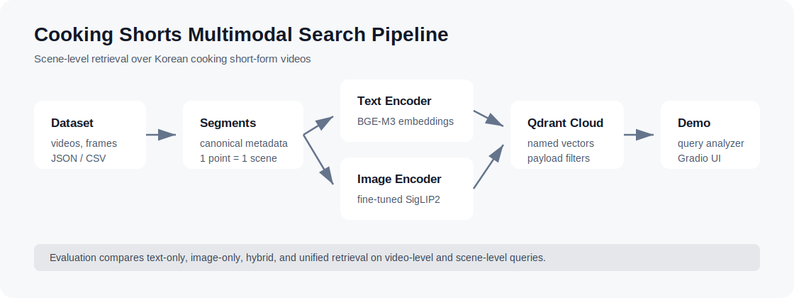

# Cooking Shorts Multimodal Search

A scene-level search demo for Korean cooking short-form videos. The system indexes short videos as searchable scene segments, then combines text retrieval and visual retrieval to find the most relevant moment for a natural-language query.

Built with Colab, Qdrant Cloud, Gradio, BGE-M3, fine-tuned SigLIP2, and an optional Gemini-powered query analyzer.



## Overview

Short-form cooking videos often contain useful information in very small time windows: ingredient preparation, seasoning, cooking actions, and final plating. A saved video list can tell you which videos you have, but it usually cannot answer questions such as "where does the cook add green onion?" or "which moment shows the finished dish?"

This project supports two related retrieval tasks:

- **Across-video search**: find relevant videos or scenes across the whole collection.
- **In-video search**: restrict the search to a specific `video_id` and find the relevant moment inside that video.

The first target domain is Korean cooking videos because cooking has clear temporal structure and many practical scene-level queries.

## Demo Examples

The demo is designed around a single natural-language search box. Users do not need to choose between text search, image search, or hybrid search manually.

| User query | Expected behavior |
| --- | --- |
| `돌솥비빔밥 영상 찾아줘` | Return video-level candidates grouped by `video_id`. |
| `대파 넣는 장면` | Return the most relevant scene clips across all videos. |
| `돌솥비빔밥 영상에서 계란 넣는 장면` | First match the recipe video, then search for the target moment inside it. |
| `short_075` + `양념 넣는 장면` | Restrict retrieval to a specific video and return in-video moments. |
| `이 영상 재료 정리해줘` | Use retrieved scenes as context for a generated summary when Gemini is available. |

## Pipeline

```text
metadata JSON / URL CSV
  -> canonical scene segment metadata
  -> fine-tuned SigLIP2 image embeddings
  -> BGE-M3 text embeddings
  -> Qdrant Cloud index
  -> query analyzer
  -> Gradio search demo
```

Each Qdrant point represents one scene segment or representative keyframe. The payload stores the video id, caption, time range, frame path, video path, recipe name, and YouTube URL.

## Retrieval

### Image-side retrieval

- Base model: `google/siglip2-base-patch16-224`
- Adapter: cooking-domain LoRA adapter
- Purpose: embed representative frames and compare them with the query encoded by the SigLIP2 text encoder.

### Text-side retrieval

- Model: `BAAI/bge-m3`
- Input text: `{recipe_name}. {caption}`
- Purpose: retrieve scenes using semantic text similarity over recipe names and scene captions.

### Hybrid retrieval

The demo exposes a unified search flow:

- unified natural-language search
- optional `video_id` filtering
- analyzer debug for inspecting the chosen search strategy

The current implementation uses a query analyzer to choose the search intent, scope, and text/image fusion weights. Gemini can be used for query analysis when an API key is available; otherwise the demo falls back to a rule-based analyzer. The individual scores remain visible so search behavior can be inspected during demos.

## Repository Structure

```text
notebooks/
  01_prepare_metadata.ipynb
  02_build_qdrant_index.ipynb
  03_gradio_demo.ipynb
  04_run_eval.ipynb

src/
  data/      metadata preparation
  models/    BGE-M3 and SigLIP2 encoder wrappers
  index/     Qdrant Cloud indexing
  search/    text/image/hybrid search, fusion, query analyzer, unified search
  generation/ optional Gemini answer generation
  ui/        Gradio demo
  eval/      evaluation metrics and runner

tests/
  lightweight unit tests for ranking and metric helpers

templates/
  editable evaluation query templates
```

## Setup

The notebooks are designed for Colab.

```bash
pip install -r requirements-colab.txt
```

Set these Colab Secrets:

```text
QDRANT_URL
QDRANT_API_KEY
GEMINI_API_KEY  # optional; rule-based analyzer is used when omitted
```

Expected Google Drive layout:

```text
MyDrive/
  korean_cooking_shorts_dataset/
    videos/
    frames/
    metadata/
      master_keyframe_dataset2.json
    urls/
      shorts_urls.csv
    siglip2_lora_qv_r16_best/
```

If your Drive layout differs, update the path variables in the notebooks.

## Running

For the first run:

```text
01_prepare_metadata.ipynb
02_build_qdrant_index.ipynb
03_gradio_demo.ipynb
```

After the Qdrant index has been built, normal demo iteration only needs:

```text
03_gradio_demo.ipynb
```

The Gradio demo includes:

- unified natural-language search
- optional `video_id`-filtered search
- Top-K result table
- representative frame gallery
- Top-1 preview clip generated from the Drive mp4
- generated answers for summary-style queries when `GEMINI_API_KEY` is available
- full-video preview near the matched timestamp when the source mp4 is accessible

## Evaluation

The quantitative evaluation is intentionally limited to retrieval questions that can be judged with stable ground truth:

- video search, such as finding a saved kimchi-jjigae short
- ingredient/action scene search, such as finding the moment green onion is added
- visual-state scene search, such as finding a plated or browned scene
- compound search, such as finding a moment inside a matched recipe video

Summary, recommendation, follow-up, and ambiguous context queries are evaluated qualitatively in the demo instead of being mixed into retrieval metrics.

By default, the evaluation builder reads `canonical_segments.parquet` and creates query specs from recipes and captions that actually appear in the dataset. It can also read `master_keyframe_dataset2.json` directly when `shorts_urls.csv` is passed for recipe names.

```bash
python -m src.eval.build_retrieval_eval_template \
  --segments /path/to/canonical_segments.parquet \
  --output data/eval/retrieval_eval_queries_draft.csv
```

Raw JSON/CSV version:

```bash
python -m src.eval.build_retrieval_eval_template \
  --segments /path/to/master_keyframe_dataset2.json \
  --urls /path/to/shorts_urls.csv \
  --output data/eval/retrieval_eval_queries_draft.csv
```

`templates/retrieval_query_specs.csv` and `templates/retrieval_eval_queries_draft.csv` are dataset-derived starting points from the current 200-video collection. Manually verify the positive videos and time ranges before reporting scores.

The generated file includes all columns from `templates/retrieval_eval_queries.csv`, plus review helpers such as `auto_match_count` and `needs_review`. It uses `positive_segments` for scene-level evaluation and `positive_video_ids` for video-level evaluation.

Retrieval metrics:

- Recall@K
- MRR
- temporal mIoU for scene-level queries
- video-id hit rate for video-level queries

The main comparison is:

```text
text-only vs image-only vs hybrid vs unified
```

Run retrieval evaluation:

```bash
python -m src.eval.run_eval \
  --queries data/eval/retrieval_eval_queries_draft.csv \
  --adapter-path /path/to/siglip2_lora_qv_r16_best \
  --output-csv data/eval/retrieval_eval_results.csv
```

Run Query Analyzer evaluation:

```bash
python -m src.eval.analyzer_eval \
  --queries data/eval/retrieval_eval_queries_draft.csv \
  --output-csv data/eval/analyzer_eval_results.csv
```

The current segment-level design is kept for evaluation because cooking search is often moment-oriented. Video-level search is measured by aggregating segment results by `video_id`. Future evaluation improvements should focus on adjacent-segment merging, multi-keyframe segment embeddings, ASR/OCR time alignment, and caption quality checks.

## Notes

- Qdrant Cloud is used as a rebuildable search index, not as the metadata source of truth.
- Source metadata remains in Google Drive JSON/CSV/Parquet files.
- Videos, frames, adapters, generated embeddings, and other large artifacts should not be committed.
- The indexing notebook can recreate the Qdrant collection; the demo notebook only reads from the existing collection.
